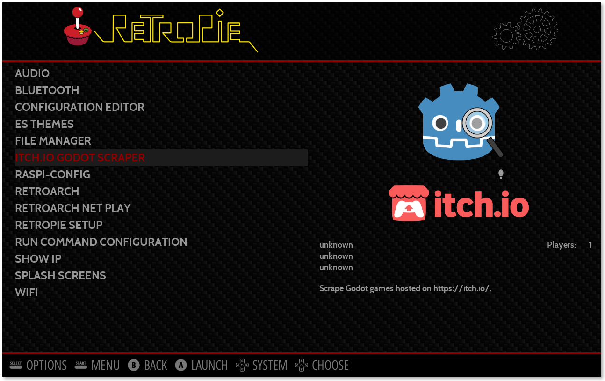

# RetroPie itch.io Godot Scraper

[](https://github.com/hiulit/RetroPie-Itchio-Godot-Scraper/releases)
[](https://github.com/hiulit/RetroPie-Itchio-Godot-Scraper/blob/master/LICENSE)


A tool for RetroPie to scrape Godot games hosted on https://itch.io/.

This scraper uses the also open-source [itch.io Godot Scraper](https://github.com/hiulit/itchio-godot-scraper) project, which scrapes all the Godot games hosted on  https://itch.io/ and creates an API that can be consumed from the following URL https://itchio-godot-scraper.now.sh/api.

## Installation

```
cd /home/pi/
git clone https://github.com/hiulit/RetroPie-Itchio-Godot-Scraper.git
cd RetroPie-Itchio-Godot-Scraper/
sudo chmod +x setup.sh
sudo chmod +x retropie-itchio-godot-scraper.sh
```

## Updating

```
cd /home/pi/RetroPie-Itchio-Godot-Scraper/
git pull
```

## 🛠️ Setup

```
./setup.sh
```
You can install the script to be launched from:

* EmulationStation's RetroPie menu
* RetroPie Setup


## 🚀 Usage

If you installed the script in EmulationStation's RetroPie menu:

* Enter EmulationStation.
* Go to the RetroPie menu.
* Select **itch.io Godot Scraper** to launch the script.




If you installed the scriptmodule, first you have to set it up:

* Run `sudo /home/pi/RetroPie-Setup/retropie_setup.sh`.
* Select **Manage packages**.
* Select **Manage optional packages**.
* Select **itchio-godot-scraper**.
* Select **Install from source**.

Now:

* Run `sudo /home/pi/RetroPie-Setup/retropie_setup.sh`.
* Select **Configuration / tools**.
* Select **itchio-godot-scraper** to launch the script.

In both cases you'll end up with a simple dialog, where you can:

* Select games to scrape.
* Scrape all games.


If you don't want to install the script, you can just run it from the downloaded folder.

```
cd /home/pi/RetroPie-Itchio-Godot-Scraper/
./retropie-itchio-godot-scraper.sh
```

## ℹ️ Troubleshooting

### The scraper can't find a game

Most likely it's because the developer didn't *properly\** name the game build, but maybe it's because the scrapper does a bad job at finding the games.

See the [itchio-godot-scraper](https://github.com/hiulit/itchio-godot-scraper) project (which is the API where this scraper takes the data from) to better understand how the scraper works and maybe tell the developer to rename the game so it's scrapable by this script. Or even better, contribute to make it better 😉.

*\* It's actually not their fault, but the scraper needs a game to be named in some kind of convention to be able to scrape it.*

## Attributions to the games

This scraper takes all the data from https://itch.io/ and some games have assets (images/videos) that are licensed under various licenses. So, to be as fair as posible, the script adds some files linking to the game's source webpage. These can be located at:

* `~/RetroPie/roms/godot-engine`
* `~/RetroPie/roms/godot-engine/images`
* `~/RetroPie/roms/godot-engine/videos`

## Changelog

See [CHANGELOG](/CHANGELOG.md).

## 👤 Author

**hiulit**

- Twitter: [@hiulit](https://twitter.com/hiulit)
- GitHub: [@hiulit](https://github.com/hiulit)

## 🤝 Contributing

Feel free to:

- [Open an issue](https://github.com/hiulit/cross-compile-godot-raspberry-pi/issues) if you find a bug.
- [Create a pull request](https://github.com/hiulit/cross-compile-godot-raspberry-pi/pulls) if you have a new cool feature to add to the project.
- [Start a new discussion](https://github.com/hiulit/cross-compile-godot-raspberry-pi/discussions) about a feature request.

## 🙌 Supporting this project

If you love this project or find it helpful, please consider supporting it through any size donations to help make it better ❤️.

[](https://www.patreon.com/hiulit)

[](https://ko-fi.com/F2F7136ND)

[](https://www.buymeacoffee.com/hiulit)

[](https://www.paypal.com/paypalme/hiulit)

If you can't, consider sharing it with the world...

[](https://twitter.com/intent/tweet?url=https%3A%2F%2Fgithub.com%2Fhiulit%2Fcross-compile-godot-raspberry-pi&text=Cross-compile+Godot+binaries+for+the+Raspberry+Pi%3A%0D%0AA+script+to+easily+cross-compile+Godot+binaries+for+the+Raspberry+Pi+from+Linux+x86_64+by+%40hiulit)

... or giving it a [star ⭐️](https://github.com/hiulit/cross-compile-godot-raspberry-pi/stargazers).

Thank you very much!

## 📝 Licenses

- Source code: [MIT License](/LICENSE).
